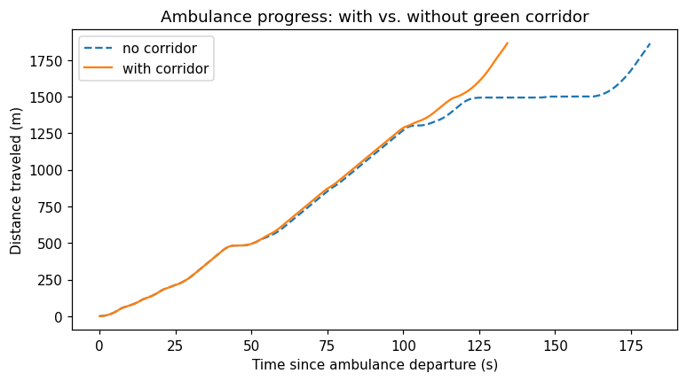
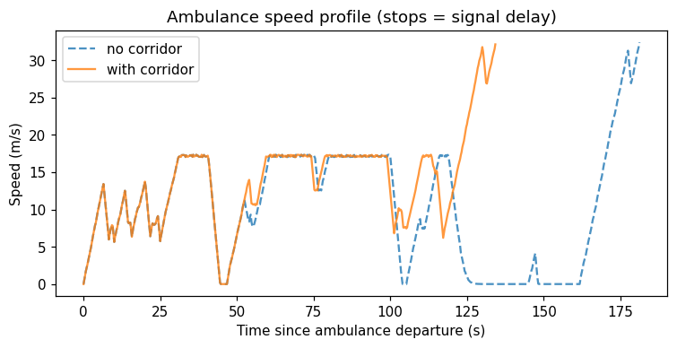
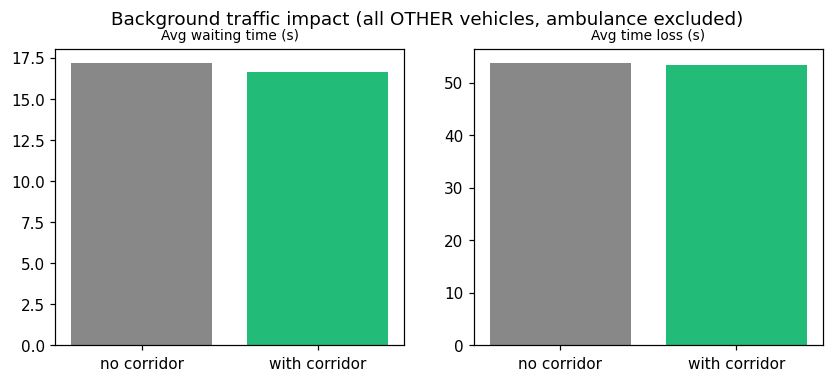

# EVATO run report: Kidwai Memorial Institute of Oncology

**Hospital:** Kidwai Memorial Institute of Oncology  (this run's colour: `30,120,255`)
**Hospital's role on the route:** destination
**Route:** `-800342307` -> `1165599560`  (40 edges, 1 signalised junctions)
**Randomly chosen other endpoint:** `-800342307`  (seed `42`, so this route is reproducible)
**Ambulance departs:** t=60s of a 600s simulation

This run drives that one route **twice**, changing nothing but the EVP layer:

| # | Scenario | Description |
|---|---|---|
| 1 | **EVP green corridor ON** | `BangaloreSCOSCA._update_emergency_preemption` forces the phase serving the ambulance's approach at every signal on its immediate path, holds it only while the ambulance is still approaching, and releases it the instant it clears. |
| 2 | **Baseline VAC - no EVP** | Identical adaptive signal control, but the ambulance gets no priority; it is treated as any other vehicle. |

Because both scenarios drive an identical route with an identical seed, any
difference below is attributable to the EVP layer itself.

## Verdict: EVP vs. baseline VAC

**Emergency vehicle: 25.9% faster with EVP.**

- Travel time went 181.8s (baseline VAC) -> 134.8s (EVP), a saving of 47.0s.
- Time spent stopped at signals: 35.2s -> 2.2s.
- Preemption events fired: 2.

**Rest of the network: no meaningful cost to other traffic.**

- Average waiting time for all other vehicles: 17.19s -> 16.63s (-3.2%).
- Average time loss for all other vehicles: 53.72s -> 53.27s (-0.8%).
- Network throughput: 3,498 -> 3,450 veh/h (-1.4%).

> Both scenarios ran the same route, same seed and same duration, so these differences reflect the EVP layer rather than a change in demand. Note that one paired run is a single sample - repeat across seeds before treating any small difference as a real effect.

# Full metric comparison: baseline VAC vs. EVP

Every metric recorded for both scenarios. Percentages compare the EVP run against the baseline VAC run.

Comparing **2** saved run record(s). Percentages compare each value against **no_corridor** (2026-08-19T19:40:04).

| Metric | no_corridor | with_corridor |
|---|---|---|
| *run_type* | ambulance | ambulance |
| *timestamp* | 2026-08-19T19:40:04 | 2026-08-19T19:40:04 |
| *seed* | 42 | 42 |
| *duration_sec* | 600 | 600 |
| **Ambulance travel time** | 181.75 s | 134.75 s -25.9% better |
| **Ambulance route length** | 1,865.56 m | 1,865.56 m |
| **Ambulance avg. speed** | 10.26 m/s | 13.84 m/s +34.9% better |
| **Ambulance waiting time** | 35.25 s | 2.25 s -93.6% better |
| **Preemption events** | 0 events | 2 events |
| **Throughput** | 3,498.00 veh/h | 3,450.00 veh/h -1.4% worse |
| **Trips completed** | 583 trips | 575 trips -1.4% worse |
| **Avg. speed** | 13.70 m/s | 13.67 m/s -0.2% worse |
| **Avg. trip duration** | 195.73 s | 194.73 s -0.5% better |
| **Avg. waiting time** | 17.19 s | 16.63 s -3.2% better |
| **Avg. time loss** | 53.72 s | 53.27 s -0.8% better |
| **Avg. route length** | 2,658.73 m | 2,642.58 m |
| **Time loss / meter** | 0.02 s/m | 0.02 s/m -1.1% better |

## What each metric means

- **Ambulance travel time** - Wall-clock time for the emergency vehicle to complete its route - the headline number for the green-corridor feature.
- **Ambulance route length** - Distance the emergency vehicle actually travelled start to finish.
- **Ambulance avg. speed** - Route length divided by travel time - how freely the emergency vehicle moved overall.
- **Ambulance waiting time** - Time the emergency vehicle spent fully stopped (typically at red lights) - what the green corridor is meant to drive toward zero.
- **Preemption events** - Number of traffic-light preemption engage/release events triggered by the emergency vehicle - context, not itself good or bad.
- **Throughput** - Completed trips scaled to an hourly rate - the headline measure of how much traffic the network actually cleared.
- **Trips completed** - Number of vehicle trips that finished inside the simulated window - also affects whether other raw averages are comparable (throughput bias).
- **Avg. speed** - Average vehicle speed across completed trips - higher means less time stuck at lights or in queues.
- **Avg. trip duration** - Average wall-clock time to complete a trip, start to finish.
- **Avg. waiting time** - Average time each vehicle spent stopped at signals - the number SCOSCA/CoSiCoSt tuning most directly targets.
- **Avg. time loss** - Average delay vs. free-flow travel time per trip - captures stops AND slow-downs, not just full stops.
- **Avg. route length** - Average trip distance - context only; if this shifts a lot between runs, raw time-based averages aren't a fair comparison (see time-loss/meter).
- **Time loss / meter** - Time loss normalized by trip distance - the fair way to compare runs whose trip-length mix differs.

---

*Generated by `report.py` from saved run records in `run_records/`.*

## Charts

### Ambulance trajectory

Distance traveled over time since departure. Flat stretches = stopped at a red light.
Fewer/shorter flat stretches with the corridor enabled means fewer, shorter stops.

Speed profile - drops to 0 indicate a stop. The corridor should visibly reduce how often and
how long the ambulance sits at 0 speed.

### Impact on background (normal) traffic

"No further traffic created" is checked here directly: the preemption only holds a green
while the ambulance is genuinely on that intersection's immediate approach (lookahead =
2 edges) and releases the instant it passes, so any
increase in background delay (see avg. waiting time / avg. time loss in the table above) should be
small and localized to the corridor's own cross streets - not a network-wide regression.
