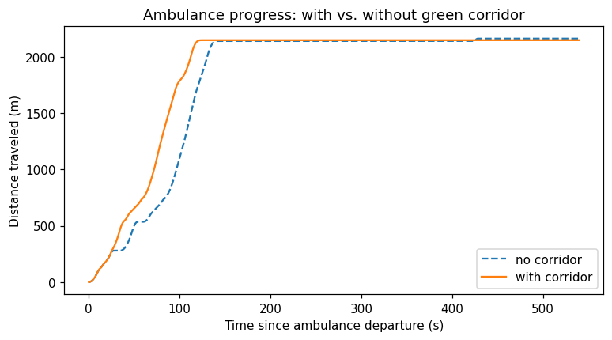
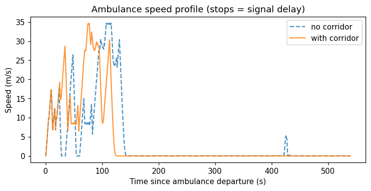
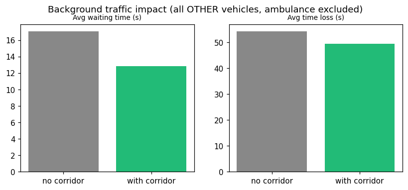

# EVATO run report: Sagar Hospitals

**Run:** `sagar_demo_run`
**Hospital:** Sagar Hospitals  (this run's colour: `255,140,0`)
**Hospital's role on the route:** destination
**Route:** `780428222#1` -> `1298979625#2`  (39 edges, 4 signalised junctions)
**Randomly chosen other endpoint:** `780428222#1`  (seed `42`, so this route is reproducible)
**Ambulance departs:** t=60s of a 600s simulation

This run drives that one route **twice**, changing nothing but the EVP layer:

| # | Scenario | Description |
|---|---|---|
| 1 | **EVP green corridor ON** | `BangaloreSCOSCA._update_emergency_preemption` forces the phase serving the ambulance's approach at every signal on its immediate path, holds it only while the ambulance is still approaching, and releases it the instant it clears. |
| 2 | **Baseline VAC - no EVP** | Identical adaptive signal control, but the ambulance gets no priority; it is treated as any other vehicle. |

Because both scenarios drive an identical route with an identical seed, any
difference below is attributable to the EVP layer itself.

> **Warning:** the ambulance did not complete its trip in both scenarios - increase `--duration` before drawing conclusions from the travel-time numbers below.

## Verdict: EVP vs. baseline VAC

**Inconclusive - the ambulance did not complete its trip in both scenarios.**

Increase `--duration` and rerun; the numbers below cannot be compared as they stand.

**Rest of the network: no meaningful cost to other traffic.**

- Average waiting time for all other vehicles: 17.07s -> 12.82s (-24.9%).
- Average time loss for all other vehicles: 54.29s -> 49.54s (-8.7%).
- Network throughput: 3,714 -> 3,408 veh/h (-8.2%).

> Both scenarios ran the same route, same seed and same duration, so these differences reflect the EVP layer rather than a change in demand. Note that one paired run is a single sample - repeat across seeds before treating any small difference as a real effect.

# Full metric comparison: baseline VAC vs. EVP

Every metric recorded for both scenarios. Percentages compare the EVP run against the baseline VAC run.

## Metrics

Comparing **2** run record(s) across **1** run(s). Percentages compare each value against **Baseline VAC (no EVP)** (2026-08-20T10:15:31).

| Metric | Baseline VAC (no EVP) | EVP (green corridor) |
|---|---|---|
| *timestamp* | 2026-08-20T10:15:31 | 2026-08-20T10:15:31 |
| **Ambulance travel time** | - | - |
| **Preemption events** | 0 events | 7 events |
| **Throughput** | 3,714.00 veh/h | 3,408.00 veh/h -8.2% worse |
| **Trips completed** | 619 trips | 568 trips -8.2% worse |
| **Avg. speed** | 49.30 km/h | 49.67 km/h +0.7% better |
| **Avg. trip duration** | 199.16 s | 192.20 s -3.5% better |
| **Avg. waiting time** | 17.07 s | 12.82 s -24.9% better |
| **Avg. time loss** | 54.29 s | 49.54 s -8.7% better |
| **Avg. route length** | 2,703.66 m | 2,650.07 m |
| **Time loss / km** | 20.34 s/km | 18.76 s/km -7.8% better |

## What each metric means

- **Ambulance travel time** - Wall-clock time for the emergency vehicle to complete its route - the headline number for the green-corridor feature.
- **Preemption events** - Number of traffic-light preemption engage/release events triggered by the emergency vehicle - context, not itself good or bad.
- **Throughput** - Completed trips scaled to an hourly rate - the headline measure of how much traffic the network actually cleared.
- **Trips completed** - Number of vehicle trips that finished inside the simulated window - a raw count, so only comparable between runs of equal duration (use Throughput otherwise).
- **Avg. speed** - Average vehicle speed across completed trips - higher means less time stuck at lights or in queues.
- **Avg. trip duration** - Average wall-clock time to complete a trip, start to finish.
- **Avg. waiting time** - Average time each vehicle spent stopped at signals - the number SCOSCA/CoSiCoSt tuning most directly targets.
- **Avg. time loss** - Average delay vs. free-flow travel time per trip - captures stops AND slow-downs, not just full stops.
- **Avg. route length** - Average trip distance - context only; if this shifts a lot between runs, raw time-based averages aren't a fair comparison (see time-loss/meter).
- **Time loss / km** - Time loss normalized by trip distance - the fair way to compare runs whose trip-length mix differs.

---

*Generated by `report.py` from saved run records in `run_records/`.*

## Charts

### Ambulance trajectory

Distance traveled over time since departure. Flat stretches = stopped at a red light.
Fewer/shorter flat stretches with the corridor enabled means fewer, shorter stops.

Speed profile - drops to 0 indicate a stop. The corridor should visibly reduce how often and
how long the ambulance sits at 0 speed.

### Impact on background (normal) traffic

"No further traffic created" is checked here directly: the preemption only holds a green
while the ambulance is genuinely on that intersection's immediate approach (lookahead =
2 edges) and releases the instant it passes, so any
increase in background delay (see avg. waiting time / avg. time loss in the table above) should be
small and localized to the corridor's own cross streets - not a network-wide regression.
